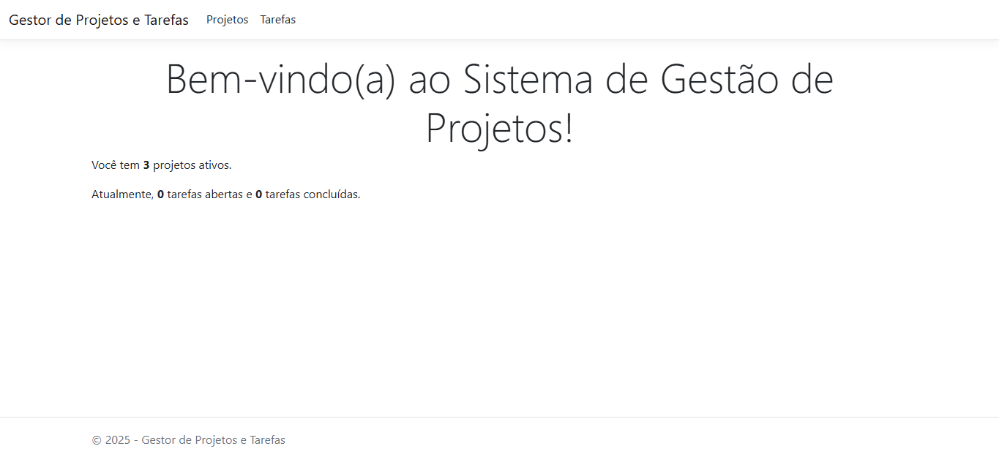

# gestor-projetos-tarefas

Trabalho final da disciplina de ASP.NET Core MVC com Entity Framework Core.  
O objetivo é demonstrar a capacidade de construir uma aplicação web completa aplicando os conceitos de MVC, persistência de dados e relacionamento 1:N entre entidades.



---

## Funcionalidades
O sistema permite gerenciar Projetos e suas respectivas Tarefas:

- Cadastro, listagem, edição e exclusão de **Projetos**;
- Cadastro, listagem, edição e exclusão de **Tarefas** vinculadas a cada Projeto;
- Visualização de todas as Tarefas associadas ao Projeto ao acessar os detalhes de um Projeto;
- Navegação clara entre telas, respeitando boas práticas de organização de código.

## Tecnologias Utilizadas
- ASP.NET Core MVC
- Entity Framework Core
- Banco de dados
- Visual Studio

## Como Executar
1. Clone este repositório:
```bash
git clone https://github.com/luizakarlec/gestor-projetos-tarefas.git
```
2. Abra a solução .sln no Visual Studio.
3. Compile e execute a aplicação (F5 ou dotnet run).
4. Navegue pelas telas para cadastrar e gerenciar Projetos e Tarefas.
